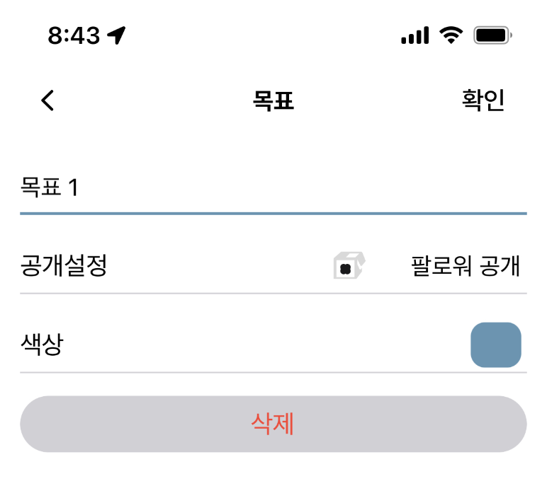
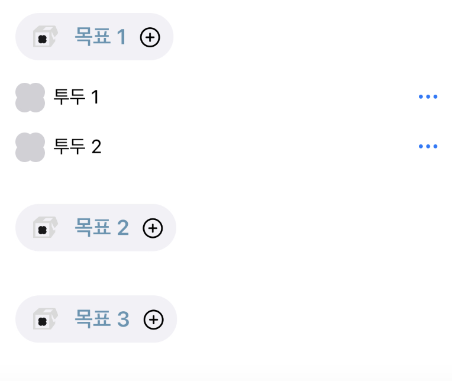
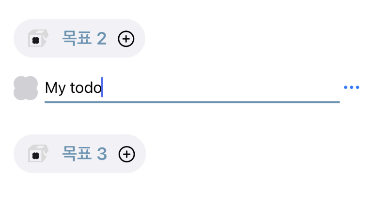
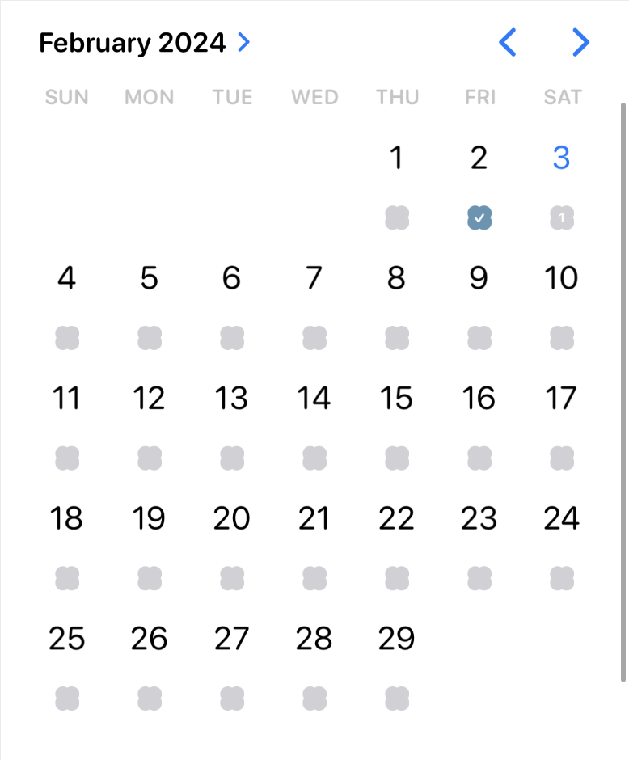
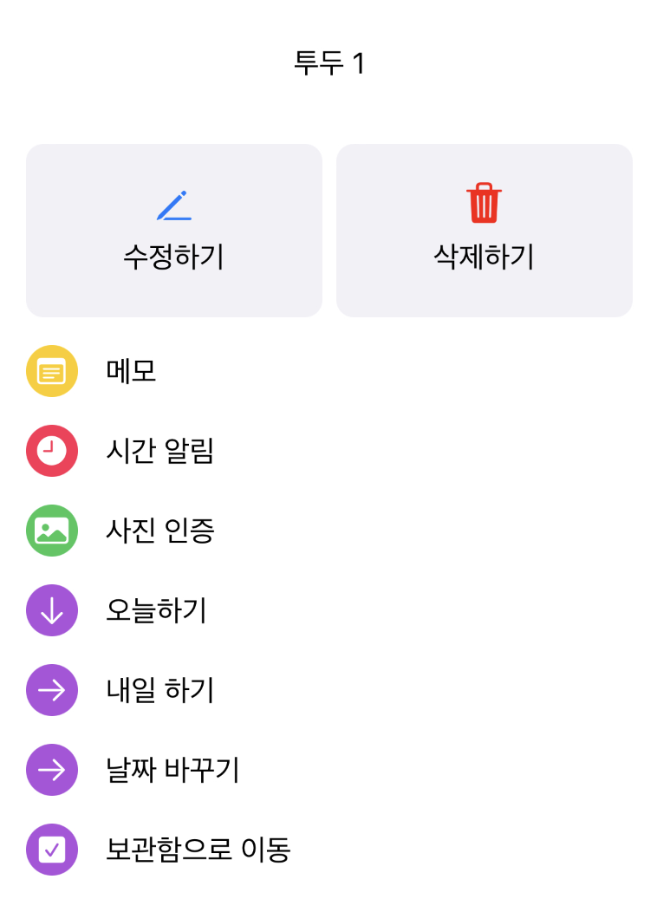
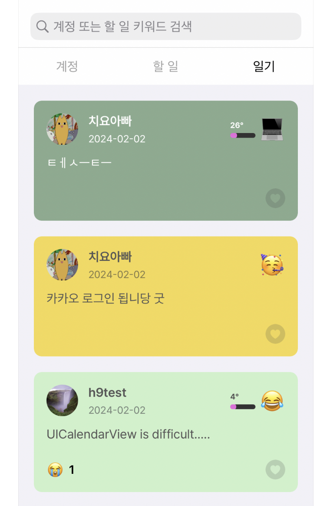
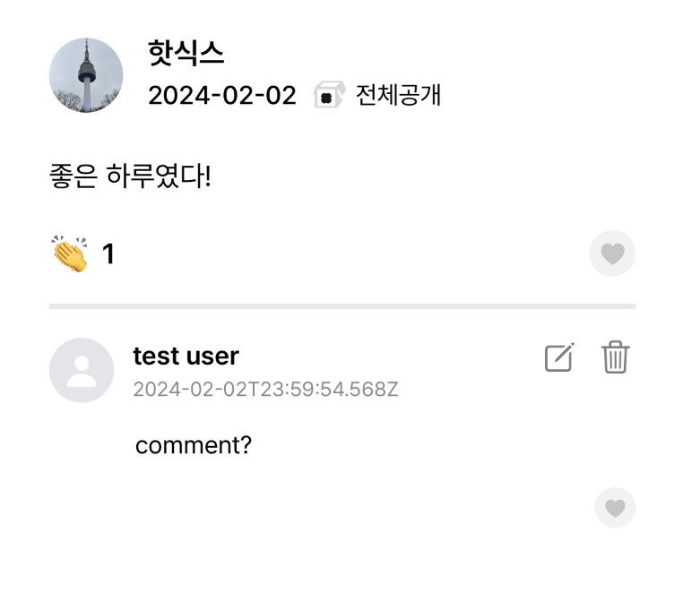
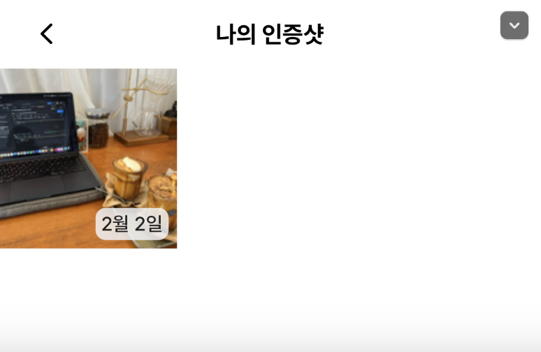

# team1-server

# Watomate Server

---

## About the project


 

- Watomate is a cloning project of the App “Todomate”, a planner application that also works as a SNS platform.

---

## Contributors

|  |  |
|:--:|:--:|
💡 [임지한](https://github.com/jhlim101/) | 💡 [강민성](https://github.com/jhlim101) |


---

## Features (cloned from app)

Goal:
- Long-term objectives, used to organize and group todos
- Visibility can be set to Public, Private, or Followers Only





Todo:
- Short-term objectives set by the user
- Todos can be created in two ways:
   - in the Home Page, where they are immediately assigned a specific date by the user,
   - or in the My Page, where they act as a memo space before the user decides when to do something. (assign today, assign tomorrow etc.)
- Calendar in the Home page displays how many todos there are left for each day
- Includes like (reaction) feature from other users







Diary:
- Reflections that users can post daily
- Same visibility feature as Goal (Public, Private, Followers)
- Includes mood meter and emoji feature
- Other users can comment on posted diaries
- Diary ‘Feed’ feature




---

Additional Features

- Added a frame (테두리) that displays on User’s profile picture if they complete all todos assigned today
- Users can post photos (인증샷) on each todo after completed. These are displayed in the Todo Feed page
- Comments can be added on both Diaries and Todos





---

## Used Tech Stack

```jsx
asgiref==3.7.2
attrs==23.2.0
awsebcli==3.20.10
blessed==1.20.0
botocore==1.31.85
cement==2.8.2
certifi==2023.11.17
charset-normalizer==3.3.2
colorama==0.4.3
Django==5.0
django-rest-framework==0.1.0
djangorestframework==3.14.0
drf-spectacular==0.27.0
idna==3.6
inflection==0.5.1
jmespath==1.0.1
jsonschema==4.20.0
jsonschema-specifications==2023.12.1
mysqlclient==2.1.1
pathspec==0.10.1
Pillow==10.1.0
python-dateutil==2.8.2
pytz==2023.3.post1
PyYAML==6.0.1
referencing==0.32.0
requests==2.31.0
rpds-py==0.16.2
semantic-version==2.8.5
six==1.16.0
sqlparse==0.4.4
termcolor==1.1.0
uritemplate==4.1.1
urllib3==1.26.18
wcwidth==0.1.9
```

- Please install before opening/deploying server with this command

```jsx
pip install -r requirements.txt
```

## Other Tools:

- AWS EC2 Instance (Free Tier)
- Amazon RDS for MySQL (Free Tier)
- Postman (for testing API)

---

## DB Schema / Entity-relationship Diagram


- Made using Lucid Chart (https://lucid.app/)

---

## URLs


- You can check the details of urls in the url down below after opening the local server.

```jsx
http://127.0.0.1:8000/api/
```

- Or you can check our api here.

```jsx
http://toyproject-envs.eba-hwxrhnpx.ap-northeast-2.elasticbeanstalk.com/api/schema/docs/#/
```
